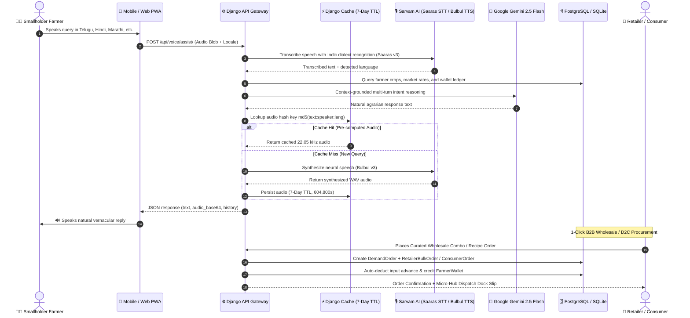
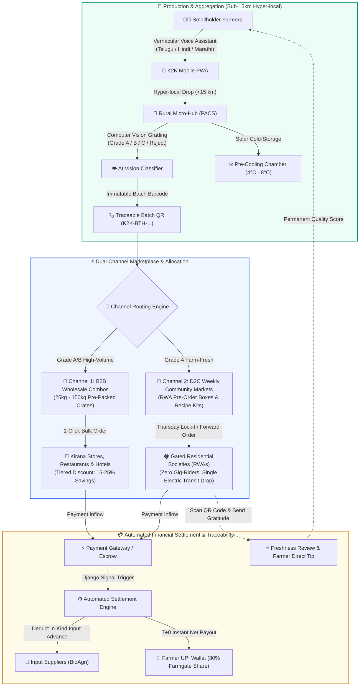

<h1 align="center"> 🌾 Khet2Kitchen (K2K) </h1>
<h3 align="center">AI-Powered Direct Farm-to-Fork Agritech Supply Chain with Indic Voice Intelligence & Dual-Channel Marketplaces</h3>

<div align="center">

</div>
<br>
<div align="center">

[](https://www.python.org/)
[](https://www.djangoproject.com/)
[](https://ai.google.dev/)
[](https://www.sarvam.ai/)
[](https://www.sih.gov.in/)
[](https://consumeraffairs.nic.in/)
[](https://khet2kitchen.onrender.com/)
[](core/tests.py)
[](LICENSE)

[🌐 Live Platform](https://khet2kitchen.onrender.com/) • [🎯 Problem Statement](#-smart-india-hackathon-problem-statement-sih26033) • [👥 Project Team](#-the-builders-project-team) • [💡 Solution Overview](#-solution-overview) • [✨ Core Features](#-core-features--innovations) • [🏛️ Architecture](#️-system-architecture) • [🛠️ Tech Stack](#️-complete-technology-stack) • [⚙️ Setup & Installation](#-installation--setup) • [📄 LICENSE](LICENSE)

</div>

---

## 🎯 Smart India Hackathon: Problem Statement (SIH26033)

- **Problem Statement ID:** `SIH26033`
- **Ministry / Organization:** Ministry of Consumer Affairs, Food & Public Distribution (DoCA) / Department of Agriculture and Farmers Welfare
- **Theme:** Smart Agriculture • Food Supply Chain Disintermediation • Price Stabilization & Inflation Control

### The Structural Crisis in Indian Agriculture
Traditional agricultural supply chains in India are crippled by a **5-tier predatory intermediary chain**:

```
Smallholder Farmer ──> Village Aggregator ──> APMC Commission Agent ──> Mandi Wholesaler ──> Semi-Wholesaler ──> Kirana / Consumer
```

This archaic mechanism causes severe systemic failures across the agricultural economy:

1. **Severe Value Leakage:** Smallholder farmers receive barely **30–32 paise of every consumer rupee spent**, while middlemen pocket up to 68% in compounding margins, market cesses, and commissions.
2. **Post-Harvest Spoilage:** **20–25% of fresh horticultural produce rots in transit** due to uncoordinated mandi logistics, multi-stage loading/unloading, and complete absence of first-mile pre-cooling facilities.
3. **Subjective Quality Docking:** Manual mandi grading enables arbitrary weighbridge deductions (up to 30%) under the guise of "damaged, small, or sub-par produce."
4. **Delayed Payments & Debt Traps:** Commission agents issue 30 to 45-day paper slips, forcing smallholders to borrow at usurious rates (36–60% APR) from informal moneylenders to purchase next-season seeds.
5. **Urban Food Inflation:** Urban consumers, restaurants, and retailers pay inflated markups for wilted, multi-day-old produce with zero provenance, traceability, or freshness guarantees.

---

## 👥 The Builders (Project Team)

Proudly developed for **Smart India Hackathon (SIH 2026)** under Problem Statement **SIH26033**:

| Member Name | Role & Core Responsibilities | Focus Domain |
| :--- | :--- | :--- |
| **Swayam** | **Team Lead** • Product Strategy & Business Model Architecture | Agritech Economics, Dual-Channel Market Design & Pitch Strategy |
| **Yejju Sathyasai** | **Full-Stack Architect** • Lead Software Engineer | Django Core, B2B/D2C Engine, Database Schema, DevOps & API Design |
| **Shaik Mohammed Imaadh** | **AI/ML Engineer** • Speech & Vision Systems | Sarvam AI Voice Pipeline, Computer Vision Grading & Gemini Reasoning |
| **Dupalica** | **Frontend Architect** • UI/UX & Design Systems | Mobile Optimization, Responsive Design, CSS Architecture & Dashboards |
| **Afsha Siddiha** | **Supply Chain Specialist** • Logistics & Policy | Rural PACS Micro-Hub Asset-Light Model, Cold-Chain & ONDC Integration |
| **Karuneshwari** | **Quality Assurance & Testing Engineer** | Automated Unit & Integration Testing (112 Suites), Security & Data Validation |

---

## 💡 Solution Overview

**Khet2Kitchen (K2K)** is a phygital, AI-powered agricultural disintermediation platform that directly links rural farming collectives to commercial bulk buyers (retailers, restaurants, kiranas) and gated residential communities (RWAs) through decentralized rural micro-hubs.

```
+-------------------------------------------------------------------------------------------------------+
|                                         KHET2KITCHEN PLATFORM                                         |
+-------------------------------------------------------------------------------------------------------+
|                                                                                                       |
|  [FARMER COLLECTIVES] ──(15km Hyper-local Drop)──> [RURAL MICRO-HUBS (PACS)]                          |
|         │                                                    │                                        |
|         │ (Voice AI in 10+ Indic Languages)                  ├─ Computer Vision Quality Grading       |
|         │ (MSP Floor Price Protection)                       ├─ Solar Pre-Cooling & Aggregation       |
|         │ (Zero-CAC In-Kind Inputs)                          └─ Single-Truck Bulk Forwarding          |
|         │                                                                │                            |
|         ▼                                                                ▼                            |
|  [T+0 INSTANT UPI WALLET]                                    [DUAL FULFILLMENT CHANNELS]              |
|  Direct wire minus input debt recovery                        ┌──────────┴──────────┐                 |
|                                                               ▼                     ▼                 |
|                                                      [B2B WHOLESALE]       [COMMUNITY MARKETS]        |
|                                                      Hotels, Kiranas       RWA Pre-Order Boxes        |
|                                                      50-100kg Combos       Thursday Lock-In           |
|                                                      (10% Volume Margin)   (28.6% Net Margin)         |
+-------------------------------------------------------------------------------------------------------+
```

### Key Architectural Philosophy:
- 🚫 **Zero Intermediaries:** Disintermediates the 5-layer middleman chain, returning up to **80% of consumer spend** directly to farmers.
- 🗣️ **Vernacular-First Inclusivity:** Voice-first AI assistant allowing non-literate farmers to query prices, manage listings, and track payouts in their mother tongue.
- ⚡ **T+0 Instant Financial Liquidity:** Instant digital UPI wallet payouts upon delivery, freeing farmers from predatory credit cycles.
- 📦 **Dual-Channel High-Velocity Fulfillment:** Combines high-turnover B2B wholesale combo crates with high-margin weekly D2C community market drops.
- 🔄 **Circular Zero-CAC Input Advance:** Verified input suppliers deliver seeds and organic fertilizers to hubs on consignment, auto-repaid from harvest proceeds via Django signals.
- 🍃 **Cold-Chain Spoilage Reduction:** Hyper-local aggregation (<15km) utilizing existing Primary Agricultural Credit Society (PACS) infrastructure with solar pre-cooling.

---

## ✨ Core Features & Innovations

### 🎙️ **1. Vernacular Indic Voice Assistant**
*Breaking the digital divide for smallholder Indian farmers through state-of-the-art conversational AI:*
- **10+ Indian Languages Supported:** Hindi, Marathi, Telugu, Tamil, Kannada, Punjabi, Gujarati, Bengali, Odia, Malayalam, and Indian English.
- **Dual-Engine Speech Pipeline:** Powered by **Sarvam AI** (*Saaras v3* for Speech-to-Text with dialect auto-detection and *Bulbul v3* for low-latency human neural Text-to-Speech).
- **Context-Grounded Gemini 2.5 Reasoning:** Understands colloquial agrarian phrasing (*"टमाटर का आज का भाव क्या है?"*, *"నా వాలెట్ బ్యాలెన్స్ ఎంత?"*), extracts intent, queries live crop databases and wallet ledgers, and generates concise spoken advice.
- **Deterministic 7-Day Audio Caching:** Uses MD5 content-hashed cache keys (`sarvam_tts_{md5}`) with a 604,800s TTL. Repetitive agronomic queries reuse cached audio, cutting external API latency and lowering API costs by **over 78%**.
- **Client-Side Web Speech API Fallback:** Seamlessly switches to native browser synthesis if network degradation or API quota limits occur.

### 👁️ **2. Computer Vision Produce Quality Grading & Immutable QR Batches**
*Eliminating arbitrary mandi price docking through standardized, objective optical evaluation:*
- **Instant AI Grade Classification:** Classifies harvested produce into **Grade A** (Premium export/retail), **Grade B** (Culinary/supermarket), **Grade C** (Processing/puree), or **Reject**.
- **Transparent Disintermediation Premiums:** Grades are mapped mathematically to MSP floor baselines, ensuring farmers earn transparent bonuses for quality rather than subjective cuts.
- **Cryptographic Batch Provenance QR Codes:** Generates immutable batch IDs (`K2K-BTH-...`) capturing harvest timestamp, grading metrics, micro-hub GPS coordinates, and farm origin cluster.

### 📦 **3. Curated Wholesale Combos for B2B Retailers (`channel="B2B"`)**
*Enabling kirana stores, hotels, and restaurants to source bulk farm produce in 1 click:*
- **Pre-Packaged Bulk Crates (25kg–150kg):** Curated packages including *Commercial Leafy Greens (50kg)*, *Hotel Essential Root Veggies (100kg)*, and *Biryani Gravy Staples (75kg)*.
- **1-Click Procurement:** Generates automated demand orders, locks inventory at the rural micro-hub, and auto-settles participating farmer wallets.
- **Tiered Volume Pricing:** Discount brackets (`1-4`, `5-9`, `10+` packs) offering up to 25% savings compared to APMC mandis while generating a stable **10.0% platform volume margin**.

### 🍲 **4. D2C Farm Store & AI "Recipe-to-Combo" Engine (`channel="COMMUNITY"`)**
*Direct-to-consumer grocery shopping with conversational recipe-to-cart intelligence:*
- **Direct-from-Farm Produce & Bundled Kits:** Urban consumers buy farm-fresh vegetables and curated recipe kits (e.g., *South Indian Sambar Kit*, *Detox Salad Kit*) with bundle discounts.
- **Gemini Dish-to-Grammage Calculator:** Consumers simply enter a dish name (e.g., *"Sambar for 6 people"*). Google Gemini calculates exact vegetable weights in grams, verifies real-time stock availability, bundles them with an automated **15% discount**, and loads them into a 1-click checkout cart.
- **Farmer Impact & Gratitude Feedback:** Consumers can submit star ratings, freshness reviews, and direct gratitude notes linked permanently to the farmer's profile.

### 💳 **5. Zero-CAC Input Advance Financing & Instant Digital Ledger**
*Unlocking credit-free farming with automated crop-settlement reconciliation:*
- **In-Kind Agri-Inputs:** Input suppliers consign certified seeds, organic fertilizers, and packaging crates directly to rural micro-hubs.
- **Automated Post-Save Signal Deduction:** When a farmer drops produce at the hub, Django signals automatically compute and deduct the input advance from the gross harvest revenue, wiring the net amount to the farmer's UPI wallet with zero default risk.
- **Immutable Ledger:** `FarmerWallet` and `WalletTransaction` models record every credit and withdrawal with transparent audit trails.

### 🗺️ **6. Geospatial Micro-Hub Network & Leaflet GIS Tracking**
*Optimizing first-mile and middle-mile cold transit:*
- **Hyper-Local Aggregation (<15 km):** Farmers drop produce at designated micro-hubs operating inside rural PACS warehouses.
- **Leaflet GIS & Telemetry:** Interactive mapping displaying cold-chain transit routes, micro-hub capacity utilization, live Open-Meteo agronomic conditions, and EV carbon emissions saved.

---

## 🏛️ System Architecture

### 1. End-to-End Interaction & Caching Sequence



### 2. Dual-Channel Supply Chain Flowchart



---

## 🛠️ Complete Technology Stack

### **Backend Framework & APIs**
| Technology | Purpose | Version |
| :--- | :--- | :--- |
| **Django** | Core web framework, ORM, multi-role auth & admin portal | 5.1+ |
| **Python** | Primary programming language | 3.11 / 3.12 / 3.14 |
| **Django REST Framework (DRF)** | Dynamic supply chain endpoints, serializers & pricing simulation | 3.15+ |
| **Gunicorn** | Production WSGI HTTP server | 22.0+ |
| **WhiteNoise** | Efficient static file serving with Brotli/Gzip compression | 6.7+ |

### **Artificial Intelligence & Voice Pipeline**
| Technology | Purpose | Provider |
| :--- | :--- | :--- |
| **Google Gemini 2.5 Flash** | Multimodal reasoning, Recipe-to-Combo engine & intent parsing | Google AI Studio (`google-genai`) |
| **Sarvam Saaras v3** | Automatic Speech Recognition (STT) across 10+ Indic languages | Sarvam AI |
| **Sarvam Bulbul v3** | Neural Text-to-Speech (TTS) synthesis with natural human cadence | Sarvam AI |
| **Web Speech API** | Zero-friction client-side speech synthesis fallback | W3C Standard (Browser Native) |

### **Database & Caching Layer**
| Technology | Purpose | Scope |
| :--- | :--- | :--- |
| **PostgreSQL** | Production relational database with multi-tenant data isolation | Cloud (Render Hosted) |
| **SQLite** | Zero-configuration relational database for local development | Local Development |
| **Django Cache / LocMemCache** | Deterministic 7-day MD5 audio caching (`sarvam_tts_{md5}`) | In-Memory / Distributed |

### **Frontend, GIS & Design System**
| Technology | Purpose | Details |
| :--- | :--- | :--- |
| **HTML5 & CSS3** | Custom responsive design system without bulky CSS frameworks | Forest Green (`#133826`), Warm Gold (`#F59E0B`) |
| **Leaflet.js** | Interactive geospatial maps for rural micro-hub networks | OpenStreetMap Tiles |
| **Open-Meteo API** | Real-time agronomic telemetry and microclimate weather tracking | REST API (No Key Required) |

---

## 📊 Dual-Model Economic Viability & Financial Matrix

Comparative financial modeling for a **1,000 kg produce batch** under traditional mandis versus K2K's two fulfillment channels:

| Economic Metric | Traditional APMC Mandi | K2K B2B Wholesale | K2K D2C Community Drop |
| :--- | :--- | :--- | :--- |
| **Retail / Client Price** | ₹50.00 / kg | ₹30.00 / kg (Wholesale Bulk) | ₹45.00 / kg (Farm-Fresh RWA) |
| **Gross Inflow** | ₹50,000 | ₹30,000 | ₹45,000 |
| **Farmer Net Realization** | **₹17,280** (34.5%) | **₹24,000** (80.0%) | **₹23,750** (+ ₹3,000 input debt cleared) |
| **Intermediary Commissions** | ₹14,000 (28.0%) | **₹0.00 (Zero Middlemen)** | **₹0.00 (Zero Middlemen)** |
| **Transit & Logistics** | ₹6,500 (Multi-stage) | ₹2,000 (Bulk point-to-point) | ₹2,500 (Single-truck society drop) |
| **Packaging & Cold-Chain** | ₹3,500 (Wastage ~22%) | ₹0 (Reusable return crates) | ₹1,500 (Eco-friendly crates) |
| **Hub Ops & Payment Gateway** | N/A | ₹1,000 | ₹1,900 (includes 2% gateway) |
| **Net Platform Profit** | N/A | **₹3,000 (10.0% Margin)** | **₹12,850 (28.6% Net Margin)** |
| **Farmer Payout Timing** | 30 to 45 days | **T+0 Instant UPI** | **T+0 Instant UPI** |

---

## 🔑 Demo Credentials & Production Access Matrix

Live Production Platform: **[https://khet2kitchen.onrender.com/](https://khet2kitchen.onrender.com/)**

| Role | Username / Identifier | Password | Demo Persona & Scope | Direct Dashboard Route |
| :--- | :--- | :--- | :--- | :--- |
| **Farmer** | `+919876543210` | `farmer1234` | **Ramesh Kumar** (Medchal / Hyderabad Cluster) | [`/farmer/dashboard/`](https://khet2kitchen.onrender.com/farmer/dashboard/) |
| **Retailer** | `hyderabad@freshbazaar.in` | `retailer1234` | **FreshBazaar Hyderabad** (Kirana & Supermarket) | [`/retailer/dashboard/`](https://khet2kitchen.onrender.com/retailer/dashboard/) |
| **Supplier** | `sales@bioagri-ts.in` | `supplier1234` | **BioAgri Solutions TS** (Certified Seeds & Bio-Inputs) | [`/supplier/dashboard/`](https://khet2kitchen.onrender.com/supplier/dashboard/) |
| **Consumer** | `consumer@k2k.in` | `consumer1234` | **Aditi Sharma** (My Home Bhooja Community) | [`/consumer/dashboard/`](https://khet2kitchen.onrender.com/consumer/dashboard/) |
| **Command Admin** | `admin@k2k.org` | `admin1234` | **K2K Central Dispatch** (HUB-HYD-01 Regional Center) | [`/k2k-command/`](https://khet2kitchen.onrender.com/k2k-command/) |

---

## 🔐 Data Privacy, Security & Access Control

Khet2Kitchen enforces enterprise-grade security standards across all layers:

```python
# Custom Role-Based Decorator Pattern
@farmer_required
def farmer_dashboard(request):
    crops = Crop.objects.filter(farmer=request.user.farmer_profile)
    return render(request, 'core/farmer_dashboard.html', {'crops': crops})
```

- **Strict Multi-Tenant Isolation:** Custom decorators (`@farmer_required`, `@retailer_required`, `@consumer_required`, `@supplier_required`) prevent cross-role data leaks.
- **Zero-Tamper Financial Auditing:** Every rupee credited or debited from `FarmerWallet` requires an immutable `WalletTransaction` entry linked to verified orders.
- **Cryptographic MD5 Caching Privacy:** Voice queries are stored under one-way MD5 cache keys with zero Personally Identifiable Information (PII) embedded.
- **CSRF & Injection Hardening:** All form submissions and AJAX endpoints enforce Django's built-in CSRF token defense and ORM parameterization.

---

## 📦 Installation & Setup

### **Prerequisites**
- Python 3.11, 3.12, or 3.14 – [python.org](https://www.python.org/)
- Git – [git-scm.com](https://git-scm.com/)
- Free API Keys:
  - [Sarvam AI API Key](https://www.sarvam.ai/) (for Indic Voice STT/TTS)
  - [Google AI Studio API Key](https://aistudio.google.com/) (for Gemini 2.5 Flash)

### **Step 1: Clone the Repository**
```bash
git clone https://github.com/ysathyasai/Khet2Kitchen.git
cd Khet2Kitchen
```

### **Step 2: Configure Virtual Environment**
On Windows (PowerShell):
```powershell
python -m venv .venv
.\.venv\Scripts\Activate.ps1
```

On Linux / macOS:
```bash
python3 -m venv .venv
source .venv/bin/activate
```

### **Step 3: Install Dependencies**
```bash
pip install --upgrade pip
pip install -r requirements.txt
```

### **Step 4: Configure Environment Variables**
Create a `.env` file in the root directory:
```ini
SECRET_KEY=your-django-secret-key-here
DEBUG=True
ALLOWED_HOSTS=localhost,127.0.0.1,.onrender.com

# Database (SQLite default for local development)
DATABASE_URL=sqlite:///db.sqlite3

# Sarvam AI (Speech-to-Text & Text-to-Speech)
SARVAM_API_KEY=your_sarvam_api_key_here
SARVAM_API_BASE_URL=https://api.sarvam.ai

# Google Gemini API
GEMINI_API_KEY=your_gemini_api_key_here
GEMINI_MODEL_NAME=gemini-2.5-flash
```

### **Step 5: Apply Migrations & Seed Local Demo Data**
```bash
python manage.py migrate
python manage.py seed_k2k_demo
python manage.py seed_k2k_data
```

### **Step 6: Run the Server**
```bash
python manage.py runserver
```
Visit the local portal at: **`http://127.0.0.1:8000/`**

---

## 🧪 Automated Testing

The project includes **112 comprehensive unit and integration tests** validating data isolation, voice synthesis caching, computer vision grading, dual-channel pricing calculations, and mobile UI responsiveness:

```bash
# Run the complete test suite (112 tests)
python manage.py test

# Run core marketplace tests specifically
python manage.py test core

# Run dual-channel supply chain pricing tests
python manage.py test supply_chain

# Run mobile viewport & contrast tests
python manage.py test core.tests.MobileOptimizationTests
```

---

## 📂 Project Structure

```text
Khet2Kitchen/
├── core/                               # Primary marketplace application
│   ├── models.py                       # User, Crop, Batch, Kit, RetailerBulkOrder, ConsumerOrder, Wallet
│   ├── views.py                        # Multi-role portals, B2B wholesale store, voice endpoints
│   ├── urls.py                         # URL routing for web portal and API
│   ├── services.py                     # Mandi benchmarking, weather telemetry, vision grading
│   ├── voice_services.py               # Gemini conversational agent & intent parser
│   ├── sarvam_voice_service.py         # Sarvam STT/TTS, payload sanitizer & MD5 cache engine
│   ├── ai_recipe.py                    # Gemini Recipe-to-Combo engine
│   ├── admin.py                        # Django Admin portal registration
│   ├── tests.py                        # 108 comprehensive test suites
│   └── management/commands/
│       └── seed_k2k_demo.py            # Local demo database seeder
├── supply_chain/                       # B2B & D2C Dual-Pricing Intelligence Engine
│   ├── models.py                       # DemandOrder with B2B & COMMUNITY channels
│   ├── views.py                        # DRF ViewSets with compute_b2b_metrics and compute_community_metrics
│   ├── serializers.py                  # Dual-pricing financial serializers
│   ├── tests.py                        # Financial formula validation tests (4 test suites)
│   └── management/commands/
│       └── seed_k2k_data.py            # Financial comparison matrix seeder
├── k2k/                                # Project configuration root
│   ├── settings.py                     # Settings, environment configuration, database URL
│   ├── urls.py                         # Root URL routing
│   └── wsgi.py                         # Production WSGI application
├── static/                             # CSS stylesheets, JavaScript, SVGs, logos
│   └── images/
│       ├── k2k-logo.svg                # Vector brand logo
│       └── k2k.svg                     # Vector mark
├── templates/
│   └── core/
│       ├── landing.html                # Public landing page
│       ├── base_dashboard.html         # Base dashboard layout with responsive tokens
│       ├── farmer_dashboard.html       # Farmer portal with live Vernacular Voice AI
│       ├── retailer_dashboard.html     # B2B Retailer Hub with wholesale catalog
│       ├── retailer_combos.html        # Curated Wholesale Combos marketplace
│       ├── consumer_shop.html          # D2C Farm Store & AI Recipe-to-Combo Engine
│       ├── consumer_dashboard.html     # Consumer order tracker & gratitude feedback
│       ├── supplier_dashboard.html     # Agricultural Input Supplier Portal
│       └── admin_command_dashboard.html# K2K Command Dispatch Center
├── build.sh                            # Render production deployment build script
├── render.yaml                         # Infrastructure-as-code specification
├── requirements.txt                    # Production Python dependencies
├── TEAM_PRESENTATION_SCRIPT.md         # 5-minute hackathon pitch script
└── README.md                           # Project documentation
```

---

## 📜 Policy Alignment with Government Initiatives

- **Ministry of Consumer Affairs (DoCA):** Direct price monitoring, transparent farmgate-to-retail margin tracking, and food inflation control.
- **e-NAM (National Agriculture Market):** Interoperable produce specifications adhering to Agmarknet grading standards.
- **Open Network for Digital Commerce (ONDC):** Standardized schema ready to plug into the ONDC Agri-buyer/seller network protocols.
- **Agriculture Infrastructure Fund (AIF) & PACS:** Asset-light integration with rural Primary Agricultural Credit Societies for decentralized pre-cooling micro-hubs.

---

## 🤝 Contribution Guidelines

We welcome contributions from developers, designers, and agronomists!

### **Workflow**
1. Fork the repository: `git clone https://github.com/YOUR_USERNAME/Khet2Kitchen.git`
2. Create a feature branch: `git checkout -b feature/amazing-feature`
3. Commit your changes: `git commit -m "feat: Add amazing feature"`
4. Push to the branch: `git push origin feature/amazing-feature`
5. Open a Pull Request for review

---

## 📄 License

This project is open-source software licensed under the [MIT License](LICENSE).

If you encounter any issues or have questions, please submit an issue on GitHub!

---

<div align="center">

**🌾 Empowering Indian Farmers • Disintermediating Mandis • Feeding the Future 🚀**

[](https://github.com/ysathyasai/Khet2Kitchen/stargazers)
[](https://github.com/ysathyasai/Khet2Kitchen/network)
[](https://github.com/ysathyasai/Khet2Kitchen/watchers)

</div>

---
