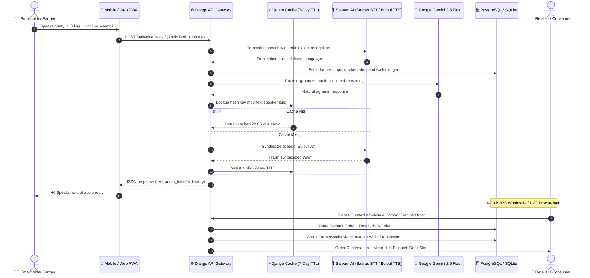

# 🌾 Khet2Kitchen (K2K)
> **AI-Powered Direct Farm-to-Fork Agritech Supply Chain with Indic Vernacular Voice Intelligence, Computer Vision Quality Grading & Dual-Channel Marketplaces**

[](https://www.sih.gov.in/)
[](https://consumeraffairs.nic.in/)
[](https://khet2kitchen.onrender.com/)
[](https://www.djangoproject.com/)
[](https://www.python.org/)
[](https://ai.google.dev/)
[](https://www.sarvam.ai/)
[](core/tests.py)
[](LICENSE)

---

## 👥 The Builders (Team Members)

Proudly developed for **Smart India Hackathon (SIH 2026)**:

| Member Name | Role & Core Responsibilities |
| :--- | :--- |
| **Swayam** | Team Lead • Product Strategy & Business Model Architecture |
| **Yejju Sathyasai** | Full-Stack Architect • Django Core, B2B/D2C Engine & DevOps |
| **Shaik Mohammed Imaadh** | AI/ML Engineer • Computer Vision Grading & Sarvam Voice Pipeline |
| **Dupalica** | Frontend Architect • Responsive Design System, UI/UX & Mobile Optimization |
| **Asifa Siddiha** | Supply Chain Specialist • Logistics, PACS Asset-Light Model & ONDC Research |
| **Karuneshwari** | Quality Assurance & Testing • Unit/Integration Test Suites & Data Validation |

---

## 🎯 Smart India Hackathon: Problem Statement (SIH26033)

- **Problem Statement ID:** `SIH26033`
- **Ministry / Organization:** Ministry of Consumer Affairs, Food & Public Distribution (DoCA) / Department of Agriculture and Farmers Welfare
- **Theme:** Smart Agriculture • Food Supply Chain Disintermediation • Price Stabilization

### The Structural Crisis in Indian Agriculture
Traditional agricultural supply chains in India are crippled by a **5-tier predatory intermediary chain**:
$$\text{Smallholder Farmer} \longrightarrow \text{Village Aggregator} \longrightarrow \text{APMC Commission Agent} \longrightarrow \text{Mandi Wholesaler} \longrightarrow \text{Semi-Wholesaler} \longrightarrow \text{Kirana / Consumer}$$

This archaic mechanism causes severe systemic failures:
1. **Severe Value Leakage:** Farmers receive barely **30–32 paise of every consumer rupee**, while middlemen pocket up to 68% in compounding margins and commissions.
2. **Post-Harvest Spoilage:** 20–25% of fresh horticultural produce rots in transit due to uncoordinated mandi logistics, multi-stage offloading, and lack of pre-cooling facilities.
3. **Subjective Quality Docking:** Manual mandi grading enables arbitrary weighbridge deductions (up to 30%) under the guise of "damaged or sub-par produce."
4. **Delayed Payments & Debt Traps:** Commission agents issue 30 to 45-day paper slips, forcing smallholders to borrow at usurious rates from informal moneylenders.
5. **Urban Food Inflation:** Urban consumers and restaurants pay inflated markups for wilted, multi-day-old produce with zero traceability.

---

## 💡 The Khet2Kitchen Solution

**Khet2Kitchen (K2K)** is a phygital, AI-powered agricultural disintermediation platform that connects rural farming collectives directly to commercial bulk buyers (retailers, restaurants, kiranas) and gated residential communities.

```
+-------------------------------------------------------------------------------------------------------+
|                                         KHET2KITCHEN PLATFORM                                         |
+-------------------------------------------------------------------------------------------------------+
|                                                                                                       |
|  [FARMER COLLECTIVES] ──(15km Hyper-local Drop)──> [RURAL MICRO-HUBS (PACS)]                          |
|         │                                                    │                                        |
|         │ (Voice AI in 10+ Indic Languages)                  ├─ Computer Vision Quality Grading       |
|         │ (MSP Floor Price Protection)                       ├─ Solar Pre-Cooling & Aggregation       |
|         │ (Zero-CAC In-Kind Inputs)                          └─ Single-Truck Bulk Forwarding          |
|         │                                                                │                            |
|         ▼                                                                ▼                            |
|  [T+0 INSTANT UPI WALLET]                                    [DUAL FULFILLMENT CHANNELS]              |
|  Direct wire minus input debt recovery                        ┌──────────┴──────────┐                 |
|                                                               ▼                     ▼                 |
|                                                      [B2B WHOLESALE]       [COMMUNITY MARKETS]        |
|                                                      Hotels, Kiranas       RWA Pre-Order Boxes        |
|                                                      50-100kg Combos       Thursday Lock-In           |
|                                                      (10% Volume Margin)   (28.6% Net Margin)         |
+-------------------------------------------------------------------------------------------------------+
```

---

## 🚀 Key Innovation Pillars

### 1. 🎙️ Vernacular Indic Voice Assistant
- **10+ Indian Languages:** Hindi, Marathi, Telugu, Tamil, Kannada, Punjabi, Gujarati, Bengali, Odia, Malayalam, and Indian English.
- **Sarvam AI Integration:** Powered by *Saaras v3* (Speech-to-Text) and *Bulbul v3* (Neural Text-to-Speech).
- **Context-Grounded Gemini 2.5 Reasoning:** Understands colloquial agrarian phrasing (e.g., *"टमाटर का आज का भाव क्या है?"*, *"ना वॉलेट बॅलन्स किती आहे?"*), extracts intent, queries live database tables, and responds concisely.
- **Deterministic 7-Day Audio Caching:** Uses MD5 content-hashed cache keys (`sarvam_tts_{md5}`) with a 604,800s TTL. Repetitive queries reuse cached audio, reducing external API costs by over 78%.
- **Zero-Friction Fallback:** Transparently falls back to the browser's native `SpeechSynthesis` API if network latency or API rate limits occur.

### 2. 👁️ Optical Produce Quality Grading (Computer Vision)
- **Automated Grade Classification:** Instant grading into **Grade A** (Premium export/retail), **Grade B** (Standard culinary), **Grade C** (Processing/puree), or **Reject**.
- **Transparent Disintermediation Premiums:** Grades are mapped mathematically to MSP floor baselines, ensuring farmers earn bonuses for top-grade crops rather than arbitrary cuts.
- **Traceable QR Batch Barcodes:** Generates immutable batch IDs (`K2K-BTH-...`) capturing harvest date, micro-hub location, and farm origin cluster.

### 3. 📦 Dual-Channel Monetization & Fulfillment
- **Channel 1: B2B Curated Wholesale Combos (`channel="B2B"`)**:
  - Pre-packaged crates (25kg to 150kg) like *Commercial Leafy Greens (50kg)*, *Hotel Essential Root Veggies (100kg)*, and *Biryani Gravy Staples (75kg)*.
  - **1-Click Procurement:** Generates automated demand orders, locks inventory at the micro-hub, and auto-settles participating farmer wallets.
  - **Tiered Volume Pricing:** Discount brackets (`1-4`, `5-9`, `10+` packs) offering up to 25% savings vs. APMC mandis while generating a stable **10% platform volume margin**.
- **Channel 2: D2C Community Weekly Markets (`channel="COMMUNITY"`)**:
  - Gated-society (RWA) pre-order model with Thursday forward-contract lock-in.
  - **Zero Gig-Rider Logistics:** Aggregated apartment delivery in a single electric transit vehicle direct to society pavilions.
  - High-margin revenue model generating **28.6% net platform margin** (₹12,850 profit per ton).

### 4. 🍲 D2C Consumer Marketplace & AI "Recipe-to-Combo" Engine
- **Direct-from-Farm Produce & Bundled Kits:** Consumers buy farm-fresh vegetables and pre-bundled kits (e.g., *South Indian Sambar Kit*, *Detox Salad Kit*) with bundle discounts.
- **Gemini Dish-to-Grammage Calculator:** Consumers type a dish name (e.g., *"Sambar for 6 people"*). Google Gemini calculates exact vegetable weights in grams, verifies inventory availability, bundles them with a 15% discount, and creates a 1-click cart.
- **Farmer Impact & Gratitude Feedback:** Consumers can submit star ratings, freshness reviews, and direct gratitude notes linked permanently to the farmer's profile.

### 5. 💳 Zero-CAC Input Advance Financing & Instant Digital Ledger
- **In-Kind Agri-Inputs:** Input suppliers consign certified seeds, organic fertilizers, and packaging crates directly to rural micro-hubs.
- **Automated Post-Save Signal Deduction:** When a farmer delivers crops to the hub, Django signals automatically compute and deduct input credit from the gross harvest revenue, routing the net wire to the farmer's UPI wallet with zero default risk.
- **Immutable Ledger:** `FarmerWallet` and `WalletTransaction` models record every credit and withdrawal with transparent audit trails.

### 6. 🗺️ Geospatial Micro-Hub Network & Cold-Chain Tracking
- **Hyper-Local Radius:** Farmers drop produce at designated micro-hubs located within a **15 km radius** (using Primary Agricultural Credit Society / PACS warehouses).
- **Leaflet GIS & Telemetry:** Visualizes real-time cold-chain transit routes, micro-hub aggregation capacities, live open-meteo agronomic conditions, and EV carbon emissions saved.

---

## 🏛️ System Architecture



---

## 💻 Complete Technology Stack

| Layer | Technology | Purpose |
| :--- | :--- | :--- |
| **Backend Framework** | **Django 5.1+ / Python 3.11–3.14** | Core web framework, ORM, REST API endpoints, and business logic |
| **REST APIs** | **Django REST Framework (DRF)** | Dynamic supply chain endpoints, pricing simulation sandbox, serializing models |
| **LLM & Reasoning** | **Google Gemini 2.5 Flash (`google-genai`)** | Agronomic intent reasoning, Recipe-to-Combo engine, and computer vision grading |
| **Indic Voice STT** | **Sarvam AI (*Saaras v3*)** | Speech-to-Text across 10+ Indic languages with dialect auto-detection |
| **Indic Voice TTS** | **Sarvam AI (*Bulbul v3*)** | Low-latency neural Text-to-Speech synthesis with human cadence |
| **Client Audio Fallback** | **Web Speech API** | Zero-friction browser-native speech synthesis fallback during quota exhaustion |
| **Database** | **SQLite (Dev) / PostgreSQL (Prod)** | Relational database with strict multi-role data isolation |
| **Caching Layer** | **Django Cache / LocMemCache / Redis** | Deterministic 7-day TTS caching, mandi price rate-limiting |
| **Frontend & Design System** | **HTML5, Vanilla CSS3, JavaScript** | Premium Dark Forest Green (`#133826`), Soft Cream (`#F4F6F1`), Warm Gold (`#F59E0B`) |
| **GIS & Mapping** | **Leaflet.js & Open-Meteo API** | Interactive micro-hub maps, weather telemetry, and EV cold transit tracking |
| **Testing Framework** | **Django Test Suite / unittest** | 108 automated unit and integration tests |
| **Cloud Hosting** | **Render (PaaS) / Gunicorn / WhiteNoise** | Continuous deployment triggered directly on `git push origin main` |

---

## 🔑 Demo Credentials & Production Access Matrix

Live URL: **[https://khet2kitchen.onrender.com/](https://khet2kitchen.onrender.com/)**

| Role | Username / Identifier | Password | Primary Demo Profile & Scope | Direct Dashboard Route |
| :--- | :--- | :--- | :--- | :--- |
| **Farmer** | `+919876543210` | `farmer1234` | **Ramesh Kumar** (Medchal / Hyderabad Cluster) | [`/farmer/dashboard/`](https://khet2kitchen.onrender.com/farmer/dashboard/) |
| **Retailer** | `hyderabad@freshbazaar.in` | `retailer1234` | **FreshBazaar Hyderabad** (Kirana & Supermarket) | [`/retailer/dashboard/`](https://khet2kitchen.onrender.com/retailer/dashboard/) |
| **Supplier** | `sales@bioagri-ts.in` | `supplier1234` | **BioAgri Solutions TS** (Seeds, Bio-Fertilizer) | [`/supplier/dashboard/`](https://khet2kitchen.onrender.com/supplier/dashboard/) |
| **Consumer** | `consumer@k2k.in` | `consumer1234` | **Aditi Sharma** (My Home Bhooja Community) | [`/consumer/dashboard/`](https://khet2kitchen.onrender.com/consumer/dashboard/) |
| **Command Admin**| `admin@k2k.org` | `admin1234` | **K2K Central Dispatch** (HUB-HYD-01 Regional Hub) | [`/k2k-command/`](https://khet2kitchen.onrender.com/k2k-command/) |

---

## 📊 Dual-Model Economic Viability Matrix

Comparative financial modeling for a **1,000 kg produce batch** under both fulfillment models:

| Metric | Traditional APMC Mandi | K2K B2B Wholesale | K2K D2C Community Drop |
| :--- | :--- | :--- | :--- |
| **Retail / Client Price** | ₹50.00 / kg | ₹30.00 / kg (Wholesale) | ₹45.00 / kg (Farm-Fresh) |
| **Gross Inflow** | ₹50,000 | ₹30,000 | ₹45,000 |
| **Farmer Net Realization** | **₹17,280** (34.5%) | **₹24,000** (80.0%) | **₹23,750** (+ ₹3,000 input debt cleared) |
| **Intermediary Commissions** | ₹14,000 (28.0%) | **₹0.00 (Zero Middlemen)** | **₹0.00 (Zero Middlemen)** |
| **Transit & Logistics** | ₹6,500 (Multi-stage) | ₹2,000 (Bulk point-to-point) | ₹2,500 (Single-truck society drop) |
| **Packaging & Cold-Chain** | ₹3,500 (Wastage ~22%)| ₹0 (Reusable crates) | ₹1,500 (Eco-friendly crates) |
| **Platform Net Profit** | N/A | **₹3,000 (10.0% Margin)** | **₹12,850 (28.6% Net Margin)** |
| **Farmer Payout Timing** | 30 to 45 days | **T+0 Instant UPI** | **T+0 Instant UPI** |

---

## ⚙️ Local Setup & Installation

### Prerequisites
- Python 3.11, 3.12, or 3.14
- Git
- Free API Keys from [Sarvam AI](https://www.sarvam.ai/) & [Google AI Studio](https://aistudio.google.com/)

### 1. Clone the Repository
```bash
git clone https://github.com/ysathyasai/Khet2Kitchen.git
cd Khet2Kitchen
```

### 2. Configure Virtual Environment
On Windows (PowerShell):
```powershell
python -m venv .venv
.\.venv\Scripts\Activate.ps1
```

On Linux / macOS:
```bash
python3 -m venv .venv
source .venv/bin/activate
```

### 3. Install Dependencies
```bash
pip install --upgrade pip
pip install -r requirements.txt
```

### 4. Configure Environment Variables
Copy `.env.example` to `.env`:
```bash
cp .env.example .env
```

Update your `.env` configuration:
```ini
SECRET_KEY=your-secret-key-here
DEBUG=True
ALLOWED_HOSTS=localhost,127.0.0.1,.onrender.com

# Database URL (SQLite default for local development)
DATABASE_URL=sqlite:///db.sqlite3

# Sarvam AI (Speech-to-Text & Text-to-Speech)
SARVAM_API_KEY=your_sarvam_api_key_here
SARVAM_API_BASE_URL=https://api.sarvam.ai

# Google Gemini API
GEMINI_API_KEY=your_gemini_api_key_here
GEMINI_MODEL_NAME=gemini-2.5-flash
```

### 5. Apply Migrations & Seed Local Demo Data
```bash
python manage.py migrate
python manage.py seed_k2k_demo
python manage.py seed_k2k_data
```

### 6. Run the Server
```bash
python manage.py runserver
```
Visit: `http://127.0.0.1:8000/`

---

## 🧪 Automated Test Suite

The project includes **108 comprehensive unit and integration tests** validating data isolation, voice synthesis caching, computer vision grading, dual-channel pricing calculations, and mobile UI rendering:

```bash
# Run all tests across the platform
python manage.py test

# Run core marketplace tests specifically
python manage.py test core

# Run dual-channel supply chain tests
python manage.py test supply_chain

# Run mobile viewport & contrast tests
python manage.py test core.tests.MobileOptimizationTests
```

---

## 📂 Project Structure

```text
Khet2Kitchen/
├── core/                               # Primary marketplace application
│   ├── models.py                       # User, Crop, Batch, Kit, RetailerBulkOrder, ConsumerOrder, Wallet
│   ├── views.py                        # Multi-role portals, B2B wholesale store, voice endpoints
│   ├── urls.py                         # URL routing for web portal and API
│   ├── services.py                     # Mandi benchmarking, weather telemetry, vision grading
│   ├── voice_services.py               # Gemini conversational agent & intent parser
│   ├── sarvam_voice_service.py         # Sarvam STT/TTS, payload sanitizer & MD5 cache engine
│   ├── ai_recipe.py                    # Gemini Recipe-to-Combo engine
│   ├── admin.py                        # Django Admin portal registration
│   ├── tests.py                        # 108 comprehensive test suites
│   └── management/commands/
│       └── seed_k2k_demo.py            # Local demo database seeder
├── supply_chain/                       # B2B & D2C Dual-Pricing Intelligence Engine
│   ├── models.py                       # DemandOrder with B2B & COMMUNITY channels
│   ├── views.py                        # DRF ViewSets with compute_b2b_metrics and compute_community_metrics
│   ├── serializers.py                  # Dual-pricing financial serializers
│   ├── tests.py                        # Financial formula validation tests
│   └── management/commands/
│       └── seed_k2k_data.py            # Financial comparison matrix seeder
├── k2k/                                # Project configuration root
│   ├── settings.py                     # Settings, environment configuration, database URL
│   ├── urls.py                         # Root URL routing
│   └── wsgi.py                         # Production WSGI application
├── static/                             # CSS stylesheets, JavaScript, SVGs, logos
├── templates/
│   └── core/
│       ├── landing.html                # Public landing page
│       ├── base_dashboard.html         # Base dashboard layout with responsive tokens
│       ├── farmer_dashboard.html       # Farmer portal with live Vernacular Voice AI
│       ├── retailer_dashboard.html     # B2B Retailer Hub with wholesale catalog
│       ├── retailer_combos.html        # Curated Wholesale Combos marketplace
│       ├── consumer_shop.html          # D2C Farm Store & AI Recipe-to-Combo Engine
│       ├── consumer_dashboard.html     # Consumer order tracker & gratitude feedback
│       ├── supplier_dashboard.html     # Agricultural Input Supplier Portal
│       └── admin_command_dashboard.html# K2K Command Dispatch Center
├── build.sh                            # Render production deployment build script
├── render.yaml                         # Infrastructure-as-code specification
├── requirements.txt                    # Production Python dependencies
└── README.md                           # Hackathon documentation
```

---

## 📜 Policy Alignment with Government Initiatives

- **Ministry of Consumer Affairs (DoCA):** Direct price monitoring, transparent farmgate-to-retail margin tracking, and food inflation control.
- **e-NAM (National Agriculture Market):** Interoperable produce specifications adhering to Agmarknet grading standards.
- **Open Network for Digital Commerce (ONDC):** Standardized schema ready to plug into the ONDC Agri-buyer/seller network protocols.
- **Agriculture Infrastructure Fund (AIF) & PACS:** Asset-light integration with rural Primary Agricultural Credit Societies for decentralized pre-cooling micro-hubs.

---

## 📄 License
This project is open-source software licensed under the [MIT License](LICENSE).
