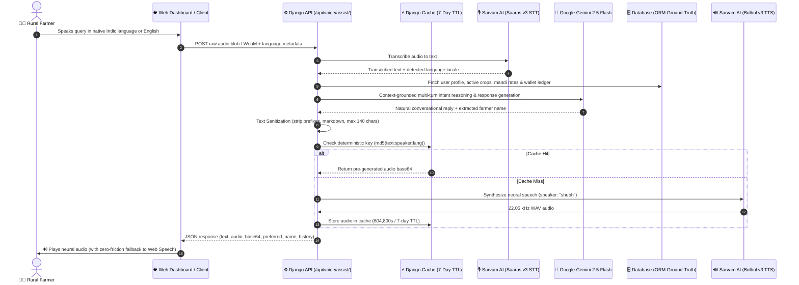

# 🌾 Khet2Kitchen (K2K)
> **AI-Powered Farm-to-Kitchen Direct Supply Chain Platform with Vernacular Indic Voice Intelligence**

[](https://www.djangoproject.com/)
[](https://www.python.org/)
[](https://www.sarvam.ai/)
[](https://ai.google.dev/)
[](LICENSE)

---

## 📖 Overview

**Khet2Kitchen (K2K)** is a modern agricultural supply chain and direct-market intelligence platform built to eliminate predatory middlemen in rural India. By connecting farmers directly with commercial bulk buyers, restaurants, and urban kitchens, K2K ensures fair pricing, rapid transparent payouts, and verified quality grading.

At the core of the platform is a **Hybrid Vernacular Voice Assistant**, purpose-built for rural farmers. Recognizing linguistic diversity and literacy challenges across rural India, K2K allows farmers to speak naturally in their native languages (Hindi, Marathi, Telugu, Tamil, Kannada, Punjabi, Gujarati, Bengali, Odia, Malayalam, or Indian English) to get real-time market prices, track active listings, inspect crop quality grades, and check their digital wallet balances.

---

## 🏛️ System Architecture



---

## ✨ Key Features

### 1. 🎙️ Vernacular Indic Voice Assistant
- **Multi-lingual Support**: Supports 10+ Indian regional languages (Hindi, Marathi, Telugu, Tamil, Kannada, Punjabi, Gujarati, Bengali, Odia, Malayalam) plus Indian English.
- **Accurate Speech-to-Text (STT)**: Powered by Sarvam AI's *Saaras v3* engine with automatic Indic dialect identification.
- **Natural Neural TTS**: Synthesizes authentic Indian audio via Sarvam AI's *Bulbul v3* (`speaker="shubh"`).

### 2. ⚡ High-Hit-Rate TTS Caching & Payload Sanitization
- **Conversational Prefix Stripping**: Automatically strips personalized dynamic prefixes (e.g., *"Hello Santosh Patil,"*, *"Welcome back Ramesh!"*, *"नमस्ते रमेश जी,"*) before generating TTS audio.
- **Markdown & Icon Cleansing**: Removes asterisks, bullets, backticks, emojis, and normalizes currency symbols (`₹` $\rightarrow$ *"rupees"* / *"रुपये"*).
- **Clean 140-Character Truncation**: Truncates spoken audio cleanly at the last full word or punctuation mark, ensuring sentences never trail off awkwardly.
- **Deterministic 7-Day Caching**: Uses `f"sarvam_tts_{md5(text:speaker:lang)}"` in Django's cache layer (`timeout=604800`). Identical business phrases across thousands of farmers reuse cached audio, drastically minimizing API credit consumption.

### 3. 🛡️ Zero-Friction Web Native Speech Fallback
- **Quota & Credit Protection**: If Sarvam AI credits run out (HTTP 402, 403, 429) or internet latency occurs, the system automatically and transparently switches to the browser's native `window.speechSynthesis`.
- **High-Definition Natural Voices**: Prioritizes Microsoft Natural Online, Google Indic, and Apple Siri voices with human-tuned cadence (`rate=0.95`, `pitch=1.0`).
- **Visual UI Independence**: Full, personalized text remains displayed in the chat interface regardless of audio backend.

### 4. 📈 Dynamic Mandi Rates & Optical Crop Grading
- **Real-Time Mandi Intelligence**: Live pricing across major Indian APMC mandis (Azadpur, Vashi, Kolar, Lasalgaon).
- **AI-Assisted Crop Quality Inspection**: Computer-vision-based grade assessment (Grade A, B, C) with transparent disintermediation bonus calculations.
- **Instant Digital Wallet**: Immediate ledger settlement on produce delivery with instant bank/UPI withdrawal.

---

## 🛠️ Technology Stack

| Layer | Technologies |
|---|---|
| **Backend Framework** | Django 5.1+, Python 3.11 - 3.14 |
| **Language Intelligence** | Google Gemini 2.5 Flash (`google-genai` SDK) |
| **Voice Processing** | Sarvam AI (*Saaras* STT & *Bulbul v3* TTS) |
| **Client Speech Fallback** | Web Speech API (`SpeechSynthesis` & `webkitSpeechRecognition`) |
| **Database** | SQLite (Dev) / PostgreSQL or MySQL (Production) |
| **Caching Layer** | Django Cache (`LocMemCache` in local dev, Redis/Memcached in prod) |
| **Frontend** | Vanilla JavaScript, HTML5, CSS3 Glassmorphism (No heavy Node.js dependencies) |

---

## 🚀 Setup & Installation Guide

### Prerequisites
- Python 3.11, 3.12, or 3.14 installed.
- Git installed on your system.
- Sarvam AI API Key ([sarvam.ai](https://www.sarvam.ai/))
- Google Gemini API Key ([aistudio.google.com](https://aistudio.google.com/))

---

### 1. Clone the Repository
```bash
git clone https://github.com/ysathyasai/Khet2Kitchen.git
cd Khet2Kitchen
```

### 2. Create and Activate Virtual Environment
On Windows (PowerShell):
```powershell
python -m venv .venv
.\.venv\Scripts\Activate.ps1
```

On Linux / macOS:
```bash
python3 -m venv .venv
source .venv/bin/activate
```

### 3. Install Dependencies
```bash
pip install --upgrade pip
pip install -r requirements.txt
```

### 4. Configure Environment Variables
Copy `.env.example` to `.env`:
```bash
cp .env.example .env
```
Open `.env` and fill in your credentials:
```ini
# Django Settings
SECRET_KEY=your-secure-django-secret-key
DEBUG=True
ALLOWED_HOSTS=localhost,127.0.0.1,.onrender.com

# Database URL (Default SQLite)
DATABASE_URL=sqlite:///db.sqlite3

# Sarvam AI API Keys (Speech-to-Text and Text-to-Speech)
SARVAM_API_KEY=your_sarvam_api_key_here
SARVAM_API_BASE_URL=https://api.sarvam.ai

# Google Gemini API Keys (Intent Reasoning & Advisory)
GEMINI_API_KEY=your_gemini_api_key_here
GEMINI_MODEL_NAME=gemini-2.5-flash
```

### 5. Apply Database Migrations & Seed Demo Data
```bash
python manage.py migrate
python manage.py check
```

*(Optional) Create a superuser to access the Django admin portal:*
```bash
python manage.py createsuperuser
```

### 6. Run the Development Server
```bash
python manage.py runserver
```

Open your browser and navigate to:
```text
http://127.0.0.1:8000/
```

---

## 🧪 Running Automated Tests

Run the full automated test suite covering all voice assist workflows, deterministic TTS caching, and multi-turn context retention:

```bash
# Run entire test suite
python manage.py test

# Run voice assistant tests specifically
python manage.py test core.tests.VoiceAssistEndpointTests
python manage.py test core.tests.VoiceServicesUnitTests
```

---

## 📂 Project Directory Structure

```text
Khet2Kitchen/
├── core/                           # Main Django application
│   ├── models.py                   # User, Crop, Batch, MandiPrice, Wallet models
│   ├── views.py                    # Application views & voice assistant endpoint
│   ├── voice_services.py           # Gemini reasoning & intent extraction pipeline
│   ├── sarvam_voice_service.py     # Sarvam STT/TTS, payload sanitizer & cache engine
│   ├── backends.py                 # Multi-role authentication backend
│   └── tests.py                    # Unit & integration test suites
├── k2k/                            # Django project configuration
│   ├── settings.py                 # Global application settings & env config
│   ├── urls.py                     # Root URL routing
│   └── wsgi.py                     # WSGI entry point
├── static/                         # Static assets (CSS, branding, SVGs, JS)
├── templates/                      # HTML templates
│   └── core/
│       ├── farmer_dashboard.html   # Farmer portal with live voice assistant
│       ├── buyer_dashboard.html    # Bulk commercial buyer dashboard
│       └── login.html              # Clean authentication page
├── .env.example                    # Template environment variables file
├── .gitignore                      # Git exclusion rules
├── manage.py                       # Django CLI runner
├── Procfile                        # Production process declaration
├── requirements.txt                # Python project dependencies
└── README.md                       # Project documentation
```

---

## 🤝 Contributing
Contributions are welcome! Please open an issue or submit a pull request for any bug fixes, additional regional dialects, or feature enhancements.

## 📄 License
This project is licensed under the [MIT License](LICENSE).
